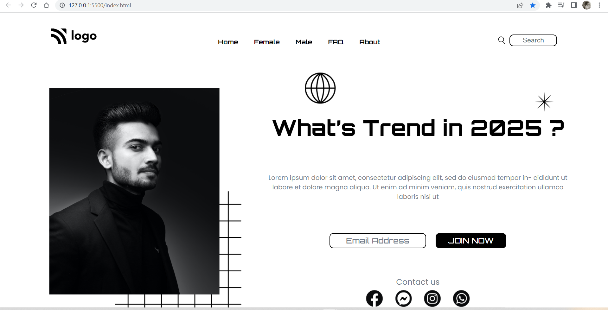

# Project 1: Street Style Landing Page

   

### Name:

> `Anshul Ghogre`

## Key Learnings from the project

- _Basic Understandings of CSS._

- _Used Pseudo-classes such as :hover , :after and nth-child() etc._

- _Learned about the more of positions properties and others aswell._

- _Used and learned the basic "order" property._

- _Last but not the least, also learned basic flex box._

---

### Screenshots:-

---

> Time taken to complete this project: 8hrs

---

## [Live-Link](https://project-1-street-style-landing1-page.netlify.app/)

---
